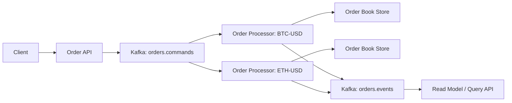

# Architecture Draft

## Summary

This draft updates the system from a single synchronous API + RocksDB matcher into an event-driven architecture:

`client -> API endpoint -> Kafka -> order processor -> order book storage`

The core idea is that each trading pair is handled by exactly one logical order processor at a time. That processor consumes commands for its pair from Kafka, applies matching in order, updates the order book, and emits resulting events.

## Assumptions

- A new `pair` field is added to every order, for example `BTC-USD`.
- `POST /orders` becomes an asynchronous command endpoint.
- Matching is no longer done inside the API handler.
- The current RocksDB-based order book can still be reused, but it moves behind the order processor instead of being mutated directly by the API process.

## Why change the architecture

The current code path is synchronous:

1. API receives `POST /orders`
2. API matches immediately
3. API updates RocksDB directly
4. API returns fills in the same request

That works for a single-process implementation, but it couples HTTP traffic, matching, and storage into one critical path.

Routing commands through Kafka gives us:

- A durable ingestion buffer between clients and the matcher
- Sequential processing per trading pair
- Independent scaling across hot and cold pairs
- Clear separation between command handling and query/read APIs
- Better failure recovery through replay

## Proposed high-level architecture

## Components

### 1. Order API

The API is responsible for:

- Authentication and request validation
- Assigning `orderId`, `requestId`, and server timestamp
- Converting HTTP requests into command messages
- Publishing commands to Kafka
- Returning an acknowledgement to the client

The API should not perform matching anymore.

Recommended behavior:

- `POST /orders` returns `202 Accepted`
- Response contains `orderId`, `requestId`, `pair`, and `status=PENDING`

If synchronous behavior is required later, the API can wait for a short-lived reply event, but the default design should stay asynchronous.

### 2. Kafka

Kafka becomes the ingestion backbone for trading commands.

Recommended topics:

- `orders.commands`
- `orders.events`
- `orders.dlq`

Recommended partitioning rule:

- Use `pair` as the Kafka message key
- All commands for the same trading pair must land on the same partition

This preserves order for a pair and lets different pairs be processed in parallel.

## Order processor model

Each logical order processor is bound to one trading pair at a time.

Responsibilities:

- Consume `PLACE_ORDER` and `CANCEL_ORDER` commands for its pair
- Maintain the pair-local buy and sell books
- Enforce price-time priority
- Prevent self-trade
- Handle GTT expiry
- Emit events such as `ORDER_OPENED`, `ORDER_FILLED`, `ORDER_PARTIALLY_FILLED`, `ORDER_CANCELLED`, and `ORDER_EXPIRED`

Important rule:

- Only the pair processor is allowed to mutate that pair's order book

This single-writer rule removes the need for a global mutex across the whole system. Ordering is guaranteed by Kafka partition order plus single-threaded processing inside the pair processor.

## Command flow

### Place order

1. Client calls `POST /orders`
2. API validates the request and enriches it with `orderId`, `requestId`, `pair`, `userId`, and timestamp
3. API publishes a `PLACE_ORDER` command to `orders.commands` with Kafka key = `pair`
4. API returns `202 Accepted`
5. The order processor for that pair consumes the command
6. The processor loads or already holds the pair order book
7. The processor matches against the opposite side of the book
8. The processor updates remaining volume or inserts the new resting order
9. The processor emits execution and status events
10. Read models are updated for `GET /orders` and execution history

### Cancel order

1. Client calls `DELETE /orders/:id`
2. API resolves the order's pair, or the pair is provided explicitly in the request path/body
3. API publishes a `CANCEL_ORDER` command keyed by the same pair
4. The pair processor consumes it and removes the order if it is still open
5. The processor emits `ORDER_CANCELLED`

For routing, including the pair in the cancel request is simpler than looking it up from storage.

## Storage design

The current RocksDB book structure is still a good fit for the matching engine because it supports:

- Fast inserts and deletes
- Efficient best bid / best ask lookup
- Ordered iteration for matching

Recommended ownership:

- Each pair processor owns the writable state for its pair
- State can be stored in RocksDB locally to the processor
- Read APIs should read from a read model or replicated query store, not from the command topic directly

Two practical options:

### Option A: Processor-local RocksDB plus replay

- Processor writes the live book to RocksDB
- On failure, a replacement processor rebuilds state from snapshot + Kafka replay

### Option B: Processor writes to a shared durable database

- Easier for queries
- Higher write latency
- More coordination pressure on the database

For this project, Option A is the closest extension of the current codebase.

## Query path

`GET /orders` should move to a read-oriented model.

The current implementation scans both RocksDB books and filters by `userId`. That is acceptable in a single-process demo, but it becomes awkward once matching is asynchronous and partitioned by pair.

Recommended read model:

- Keep a per-user open-order index
- Update it from `orders.events`
- Serve `GET /orders` from that index

This gives a clean CQRS-style split:

- Command path: API -> Kafka -> pair processor
- Query path: read model -> API

## Expiry handling

GTT expiry should also be owned by the pair processor.

Recommended behavior:

- Before matching, the processor checks whether the best resting orders are expired
- The processor also runs a periodic sweep or timer wheel for upcoming expiries
- Expired orders generate `ORDER_EXPIRED` events and are removed from the book

Expiry must happen in the same pair processor to avoid races with matching.

## Reliability notes

This architecture needs explicit delivery guarantees.

Recommended baseline:

- Kafka producer configured with `acks=all`
- Idempotent producer enabled
- Commands carry `requestId` for deduplication
- Processor is idempotent when the same command is replayed

Important failure case:

- If the API returns success before Kafka acknowledges the write, an order can be lost

So the API should either:

- Return success only after Kafka acknowledges the publish, or
- Use a transactional outbox if an API-side database is introduced

## Scaling model

Parallelism comes from pair isolation.

- `BTC-USD` and `ETH-USD` can be processed at the same time
- A very hot pair can be isolated onto a dedicated partition and processor
- Cold pairs can share the same worker process, as long as each pair still has single-writer ownership

This means "one processor per pair" is best understood as a logical ownership rule, not necessarily one OS process per pair.

## Impact on the current codebase

To move this repository toward the new architecture, the main changes would be:

1. Add `pair` to the order model and HTTP request schema
2. Replace direct matching in [`internal/trade/place_order.go`](/home/npvinh/Works/personal/bsx-trading-interview/internal/trade/place_order.go) with Kafka command publishing
3. Move matching logic into a new order processor service or worker package
4. Route cancel requests through Kafka as commands too
5. Introduce event topics and a read model for `GET /orders`
6. Keep RocksDB as the matching engine state store behind the processor

## Recommended first implementation slice

If we want to migrate incrementally, the safest sequence is:

1. Add `pair` to the API and domain model
2. Introduce Kafka publishing from the API
3. Build one order processor that handles one pair
4. Move existing `placeOrder` and `cancelOrder` logic into that processor
5. Change `POST /orders` to return an acknowledgement instead of immediate fills
6. Add event-driven read models for open orders and fills

## Final recommendation

Use a single `orders.commands` topic partitioned by `pair`, and treat each trading pair as a single-writer actor. The API should only validate and publish commands. Matching, cancellation, expiry, and order-book mutation should happen only inside the pair-bound order processor.

That keeps the matching rules deterministic while giving the system a path to scale horizontally.
